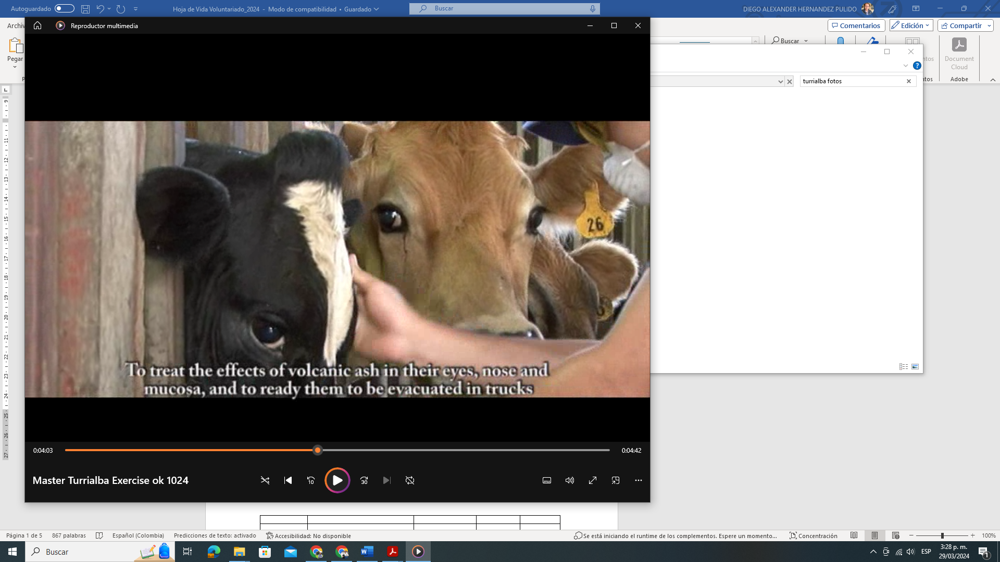
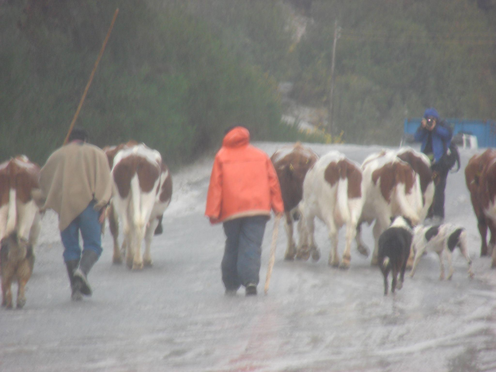
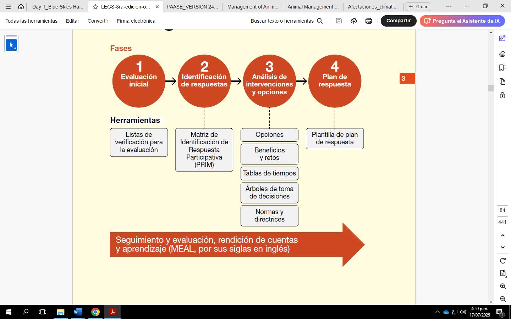
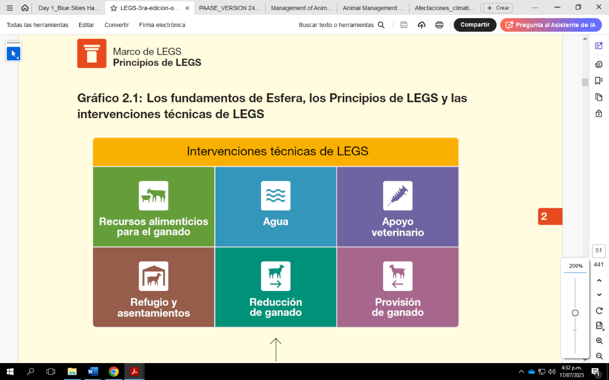
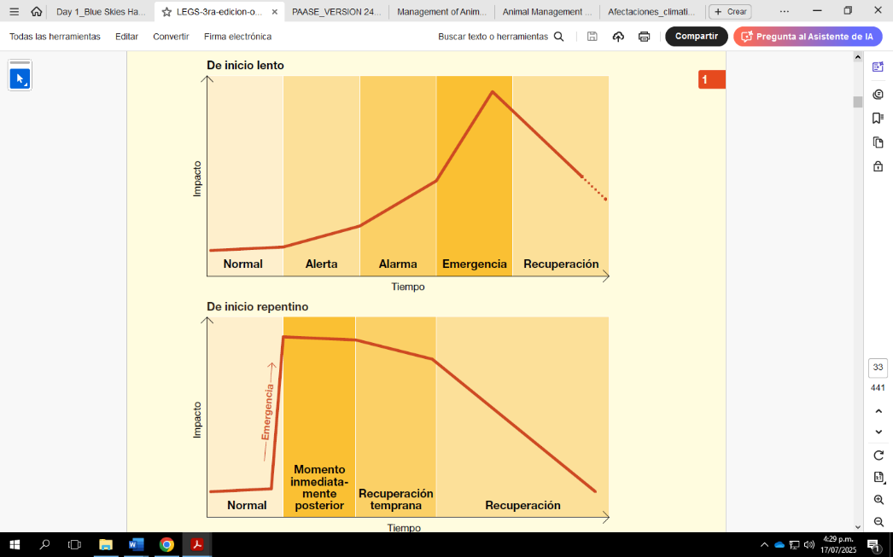
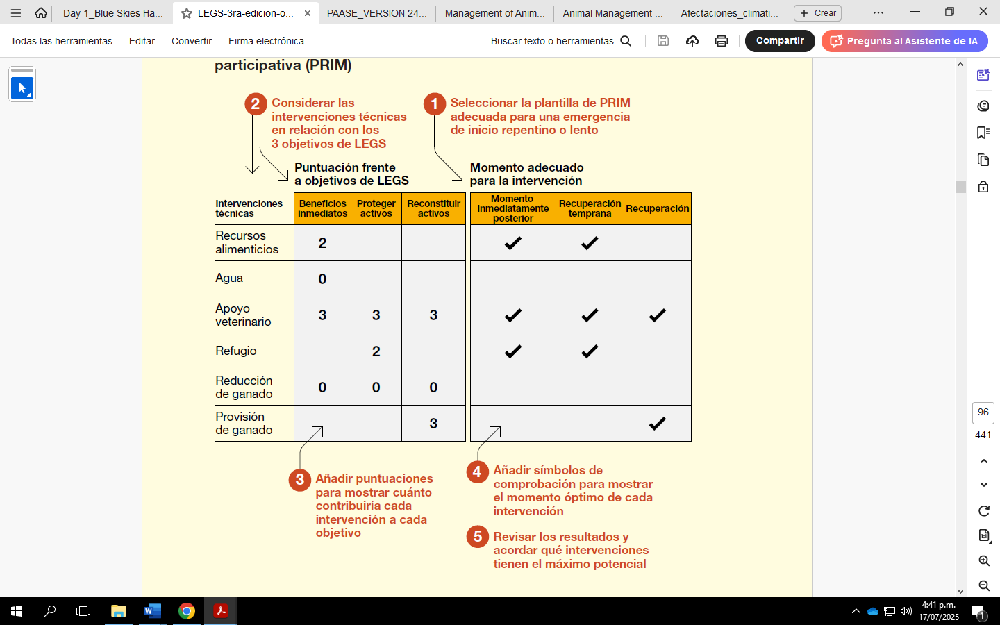

**Avances y desafíos del manejo de desastres y gestión del riesgo
volcánico con animales de producción**

Hernández-Pulido, Diego^1\*^ & Lema Vélez, Julia Inés^2^

^1^Facultad de Ciencias Agrarias, programa de Medicina veterinaria,
Fundación Universitaria Agraria de Colombia, Calle 170 \# 54ª-10, Bogotá
D.C., Colombia

^2^Facultad de Ciencias Agrarias, Fundación Universitaria Agraria de
Colombia, Calle 170 \# 54a--10, Bogotá D.C., Colombia

\*Autor de contacto: Diego Hernández Pulido. Facultad de Ciencias
Agrarias, Fundación Universitaria Agraria de Colombia. Calle 170 \#
54a--10 Bogotá. Correo-e:
[[hernandez.diegoal@uniagraria.edu.co]{.underline}](mailto:hernandez.diegoal@uniagraria.edu.co)

**Resumen**

Las laderas volcánicas son zonas fértiles ideales para la agricultura y
ganadería, pero se exponen a erupciones volcánicas que pueden generan
graves impactos en los pequeños productores, afectando sus medios de
subsistencia. Los animales sufren consecuencias crónicas como
enfermedades, inanición o muerte por ingesta de ceniza, lo que amenaza
la seguridad alimentaria y la salud pública. Las erupciones volcánicas
pueden provocar abandono, enfermedades y mortalidad animal por falta de
planes de gestión de riesgos. La solución es implementar sistemas
integrales que prioricen el bienestar animal y la protección de medios
de vida. Existe un vacío en la aplicación de políticas locales que
integren prevención, respuesta y rehabilitación. Apropiar y conocer la
temática asociada a la gestión de riesgos desastres para proteger al
ganado antes, durante y después de erupciones volcánicas promueve la
subsistencia de los agricultores. Se realiza a través de un enfoque
multidimensional que incluye: 1) Prevención: capacitación y medidas de
contingencia (alimentación segura, refugios); 2) Respuesta: protocolos
de respuesta a emergencias y procedimientos estandarizados de atención;
3) Rehabilitación: restauración de sistemas de producción y salud
animal. Se basará en políticas públicas coordinadas y participación
comunitaria. Reducción de la mortalidad animal, mitigación de pérdidas
económicas y mejora en la resiliencia de los productores. La
sensibilización y formación garantizarían una respuesta efectiva. Es
urgente integrar el bienestar animal en los planes de gestión de
desastres, con políticas públicas que fomenten la preparación
comunitaria y la cooperación interinstitucional. Se recomienda
investigar estrategias adaptadas a contextos volcánicos y promover
campañas de concientización.

**Palabras clave**: Desastres, reducción de riesgo, ganadería, volcanes,
animales

**Advances and challenges in disaster management and volcanic risk
management with farm animals**

**Abstract**

Volcanic slopes are fertile areas ideal for agriculture and livestock
farming, yet they are exposed to volcanic eruptions that have severe
impacts on small producers, affecting their livelihoods. Animals suffer
chronic consequences such as disease, starvation, or death from ash
ingestion, threatening food security and public health. Volcanic
eruptions can cause abandonment, disease and animal mortality due to the
lack of risk management plans. The solution is to implement
comprehensive systems that prioritize animal welfare and livelihood
protection. There is a gap in the application of local policies that
integrate prevention, response and rehabilitation. Learn about disaster
risk management to protect livestock before, during, and after volcanic
eruptions, and promote the livelihoods of farmers. This is done through
a multidimensional approach that includes: 1) Prevention: training and
contingency measures (safe food, shelters); 2) Response: emergency
response protocols and standardized care procedures; 3) Rehabilitation:
restoration of production systems and animal health. It will be based on
coordinated public policies and community participation. Reducing animal
mortality, mitigating economic losses, and improving producers\'
resilience. Awareness raising and training would ensure an adequate
response. There is an urgent need to integrate animal welfare into
disaster management plans and to promote public policies that foster
community preparedness and inter-institutional cooperation. It is
recommended to research strategies adapted to volcanic contexts and to
promote awareness campaigns.

**Keywords**: Disasters, risk reduction, livestock, volcanoes, [animals,
livelihood]{.mark}

# INTRODUCCIÓN 

Las erupciones volcánicas pueden ocasionar pérdidas económicas para los
pequeños agricultores y productores pecuarios que dependen de sus
[animales de producción]{.mark}. Estos animales son un medio de
subsistencia, además de ser fuente de proteína animal (leche, carne y
huevos) indispensable para una buena nutrición; también son animales de
trabajo, carga y transporte, y para millones de familias rurales, los
sistemas de producción animal son su "banco en pie", fuente de ingreso y
ahorro [\[1\]]{.mark}.

La caída de cenizas puede tener graves efectos perjudiciales en los
cultivos y en los animales. Dependiendo del grosor de las cenizas y la
presencia de fluoruro soluble, el momento y la intensidad de la
precipitación, se afectan la salud de los animales, las condiciones de
crecimiento de los cultivos y la disponibilidad de agua y alimento no
contaminados. Por otro lado, después de una erupción volcánica, la
recuperación del componente animal y vegetal depende de la cantidad de
ceniza, lava fluida, flujos piroclásticos y los gases emitidos. Debemos
tener en cuenta que las erupciones pueden desencadenar otros fenómenos
como lo son los incendios forestales, terremotos y tsunamis, lo que hará
más difícil la recuperación. La caída del contenido volcánico en las
aguas aumenta la acidez, turbidez y temperatura. Las erupciones pueden
influir en la migración de los animales, el descanso de pasturas, y la
alimentación de los animales [\[2\].]{.mark}

# CONOCIMIENTO DEL RIESGO VOLCÁNICO EN ANIMALES DE PRODUCCIÓN

Fenómenos geológicos como terremotos, volcanes, tsunamis e
hidrometeorológicos como tormentas de viento, sequías, nevadas e
inundaciones continúan impactando a las personas y los bienes expuestos
de la sociedad. Durante la última década, los desastres han provocado un
aumento de las pérdidas económicas y sociales, generando desplazamientos
y sufrimiento, esta tendencia ha llevado a una creciente dependencia de
la ayuda humanitaria \[3\]. En el caso de los animales que pastan en
libertad, el aislamiento por fenómenos como erupciones volcánicas puede
provocarles inanición y debilitar su sistema general de su salud. Si
bien el colapso de infraestructuras, los daños causados a los pastos por
la caída o saturación de cenizas pueden generar otras complicaciones
\[4\].

## 2.1 Actividad volcánica

Las áreas cercanas a los volcanes son lugares muy populares para
cultivar y criar animales de granja [debido a que]{.mark} el suelo es
muy fértil. Esto significa que cerca de cráteres aparentemente inactivos
el pastoreo de animales es muy usual. Los volcanes pueden tener efectos
crónicos sobre los animales, dependiendo de la naturaleza de la
erupción. Si una erupción es violenta, los flujos de lava, los flujos
piroclásticos, los gases venenosos y los lahares pueden enterrar,
quemar, matar y herir a los animales. A menudo la evacuación es muy
complicada debido a la naturaleza del terreno y el número de animales
presentes en estas zonas, combinados con las limitadas opciones para
alojarlos en otro lugar. Algunos habitantes de las zonas que pueden
afectarse se negarán a marcharse sin sus animales, mientras que otros
pueden dejarlos atrás, [regresar o intentar regresar a su hogar]{.mark}
y volver o intentar volver a la zona de peligro muchas veces para cuidar
de ellos, causando problemas a las autoridades \[[5]{.mark}\].

En salud humana, la exposición a las cenizas volcánicas rara vez pone en
peligro la vida humana de forma directa, excepto cuando las partículas
de ceniza son gruesas causan daños estructurales en los edificios (por
ejemplo, el colapso de los tejados) o víctimas indirectas como las que
se producen durante las operaciones de limpieza de las cenizas o en
accidentes de tráfico. Los efectos a corto plazo suelen incluir
irritación de los ojos y de las vías respiratorias superiores y
exacerbación de enfermedades respiratorias preexistentes como el asma;
los problemas de salud graves son poco frecuentes. Además, las
comunidades afectadas pueden experimentar mayores niveles de angustia
psicológica. Esto ocurre especialmente cuando las erupciones causan
trastornos sociales y económicos [\[6]{.mark}\].

Las personas deben evitar la exposición innecesaria a la ceniza y llevar
una mascarilla eficaz (Certificada industrialmente N95, FFP2 o su
equivalente) cuando esté al aire libre para reducir la inhalación de
partículas de ceniza. Las personas con problemas respiratorios deben
tener especial cuidado para evitar la exposición a la ceniza en el aire
y deben llevar consigo su medicación. Los servicios médicos pueden
esperar un aumento del número de pacientes con síntomas respiratorios y
oculares durante y después de la caída de cenizas. En general, la gente
estará muy preocupada por los efectos de la ceniza, y suelen surgir
preguntas sobre las características de la ceniza y las implicaciones
para su salud [\[6\].]{.mark}

### Efectos a largo plazo. La realidad es que los efectos a largo plazo de una erupción sobre los animales suelen ser reducidos. Por ejemplo, en el Monte Santa Helena, los científicos comprobaron que tanto plantas como animales volvieron a las zonas devastadas al cabo de un año de la erupción. Así mismo, en 1902 hubo una gran erupción en el volcán Santa María (Guatemala) la cual mató entre cientos a miles de aves [\[7\].]{.mark} 

+:------------------------------------------------------------------------+
| **Caja 1. Definiciones**                                                |
|                                                                         |
| **Medios de subsistencia o medios de vida.** Un medio de subsistencia   |
| consiste en los activos (naturales, físicos, humanos, financieros y de  |
| capital social), las actividades vinculadas a estos activos y el acceso |
| a ellos (mediado por instituciones y relaciones sociales) que juntos    |
| determinan la subsistencia obtenida por el individuo o el hogar         |
| \[[8]{.mark}\]. Comprende las habilidades, los activos (tanto           |
| materiales como sociales) y las actividades necesarias para los medios  |
| de vida. La subsistencia es sustentable cuando puede enfrentarse y      |
| recuperarse del estrés y la crisis y mantener o mejorar su capacidad y  |
| activos tanto en el presente como en el futuro, siempre y cuando sin    |
| perjudicar los recursos naturales básicos \[[9]{.mark}\].               |
|                                                                         |
| **Agropecuario o agropecuaria.** Se refiere al [sector                  |
| agrícola](https://es.wikipedia.org/wiki/Sector_agr%C3%ADcola)           |
| ([agricultura](https://es.wikipedia.org/wiki/Agricultura)) y el [sector |
| ganadero](https://es.wikipedia.org/wiki/Ganader%C3%ADa) o pecuario      |
| ([ganadería](https://es.wikipedia.org/wiki/Ganader%C3%ADa)). Estas      |
| [actividades                                                            |
| económicas](https://es.wikipedia.org/wiki/Actividades_econ%C3%B3micas), |
| junto con otras estrechamente vinculadas a las [industrias              |
| alimentarias](https://es.wikipedia.org/wiki/Industria_alimentaria), son |
| las más significativas del [medio                                       |
| rural](https://es.wikipedia.org/wiki/Medio_rural) y de las cadenas de   |
| producción y valor que del mismo se derivan \[[10]{.mark}\].            |
+-------------------------------------------------------------------------+

## 2.2 Enfoque conceptual de los medios de vida/subsistencia en entornos agropecuarios 

El marco conceptual sobre los medios de vida se remonta a los años
ochenta. En un principio, se entendían como las capacidades o activos
(que incluye recursos materiales y sociales) que se adoptan para
actividades necesarias para ganarse la vida \[[8]{.mark}\]**.** Sin
embargo, a través del tiempo nuevos marcos interpretativos aparecieron y
fueron adoptados por agencias de desarrollo. Más adelante (**Caja 2)**
aparece el concepto de medios de subsistencia sostenibles**,** marcando
un nuevo enfoque político y práctico. A la definición inicial de
capacidades, activos y actividades, se agregó el adjetivo "sostenible".
Esto implica que un medio de vida o subsistencia puede hacer frente y
recuperarse del estrés o los choques (i.e., relacionado al concepto de
resiliencia en términos de la gestión del riesgo de desastres) que se
puede mantener o mejorar sus capacidades y bienes, proporciona
oportunidades de subsistencia sostenibles para una siguiente situación,
y aporta beneficios a otros medios de vida locales y globales como en el
largo y corto plazo [\[8\]]{.mark}.

El Comité Internacional de la Cruz Roja (CICR) y el alto comisionado de
las Naciones Unidas para los refugiados [\[11\]]{.mark} define los
medios de vida como aquellas actividades que permiten asegurar las
necesidades básicas de vida: alimento, agua y vivienda. Estas
actividades significan adquirir conocimiento, habilidades, materias
primas y otros recursos para satisfacer las necesidades individuales o
colectivas de manera sostenible y con dignidad. Todas las actividades
asociadas a medios de vida se llevan a cabo repetidamente dentro de una
corriente de ingresos como la agricultura, el pastoreo, la pesca, el
empleo dentro de un sector de mercado. El trabajo proporciona la base
para su seguridad alimentaria y autosuficiencia, agregando estabilidad,
prosperidad y paz a la comunidad en general.

+----------------------------------------------------------------------------------------------------------------+
| **Caja 2. Acceso desigual a capitales clave.**                                                                 |
|                                                                                                                |
| Los capitales o activos hacen referencia a los bienes tangibles e intangibles, capacidades y demás recursos    |
| que tienen las personas o pueden acceder a ellos para alcanzar sus objetivos de medios de vida. Están          |
| representados en un pentágono que simboliza el nivel de acceso que tienen las personas a estos. Lo ideal es    |
| encontrar el pentágono simétrico, lo que indicaría un acceso equilibrado en los cinco tipos de capitales       |
| \[[12]{.mark}\].                                                                                               |
|                                                                                                                |
| Componentes principales del marco conceptual sobre los medios de vida {width="5.979166666666667in"                           |
| height="1.9444444444444444in"}                                                                                 |
|                                                                                                                |
| **Marco de los medios de vida sostenibles**. Herramienta que permite comprender cómo interactúan los medios de |
| vida familiares con el entorno, tanto con el natural como con el contexto político e institucional. Guía       |
| rápida para misiones Analizar las instituciones locales y los medios de vida. Tomado de \[11\]: Con            |
| autorización de la FAO                                                                                         |
| [[https://www.fao.org/3/a0273s/a0273s04.htm#bm04]{.underline}](https://www.fao.org/3/a0273s/a0273s04.htm#bm04) |
|                                                                                                                |
| Los componentes del marco son:                                                                                 |
|                                                                                                                |
| 1.  Los capitales o activos hacen referencia a que es lo que tienen o a que tienen acceso las personas         |
|                                                                                                                |
| 2.  Estrategias de medios de vida: lo que hacen los hogares para generar un sustento                           |
|                                                                                                                |
| 3.  Contexto de vulnerabilidad: acontecimientos previsibles o no que pueden afectar los medios de vida         |
|                                                                                                                |
| 4.  Estructuras y procesos: ambiente de gobernabilidad, política e instituciones                               |
|                                                                                                                |
| 5.  resultado de los medios de vida: Objetivos que persiguen las personas.                                     |
|                                                                                                                |
| **Definiciones de los capitales:**                                                                             |
|                                                                                                                |
| **Capital humano**: Permite desarrollar diferentes estrategias para desarrollar sus objetivos. Ej:             |
| Competencias, conocimiento, capacidad de trabajo y salud.                                                      |
|                                                                                                                |
| **Capital social**: Redes e interconexiones que incrementan la capacidad de trabajo y amplían el acceso a      |
| instituciones mayores. (i.e., pertenencia a grupos formalizados, relaciones de confianza).                     |
|                                                                                                                |
| **Capital natural**: Los recursos y las reservas naturales de las que dependen las personas tales como         |
| tierras, bosques y otros.                                                                                      |
|                                                                                                                |
| **Capital físico**: Infraestructuras básicas y bienes de producción, entre los que se incluyen: refugios,      |
| edificios, herramientas, equipos, semillas, ganado, transporte y comunicaciones.                               |
|                                                                                                                |
| **Capital financiero**: Disponibilidad de efectivo o equivalente, que permite a las personas adoptar           |
| diferentes estrategias en relación con los medios de vida: ahorros, capitales líquidos (ganado y joyas),       |
| créditos, pensiones o giros.                                                                                   |
|                                                                                                                |
| **Estrategia de los medios de vida**: Son aquellas actividades y decisiones que toman los hogares o las        |
| personas para combinar los capitales disponibles para alcanzar sus objetivos y mantener o reforzar sus medios  |
| de vida; o para hacer frente a las necesidades básicas. Ej: la agricultura, pesca, comercio, empleo público    |
| \[[12]{.mark}\].                                                                                               |
+----------------------------------------------------------------------------------------------------------------+

## 2.3 Impacto sobre el sector de la [producción animal]{.mark}

Los desastres no sólo suponen una amenaza para la humanidad, sino que
también afectan a los sistemas de producción animal. Estos son parte
integral de los activos clave de un país, y tiene un papel importante en
el crecimiento de su economía. Aunque este sector ya se enfrenta a
algunos problemas en términos de recursos alimenticios, malas
condiciones sanitarias, infraestructuras inadecuadas de
comercialización, transformación y valor añadido, los desastres y
emergencias de origen natural y socio-natural han agravado aún más su
problema y empeorado la economía al dejar efectos negativos en la
población y en el propio ganado \[[12]{.mark}\].

Cada vez que una región, un país o un lugar declara una situación de
calamidad pública por una emergencia o se declara desastre, ya sea una
inundación, un terremoto, o un volcán, el ganado es el primer afectado,
ya que las medidas de socorro y rehabilitación de los gobiernos se
centran en las personas y, por lo tanto, el sector recibe escasa
importancia y queda abandonado \[[12]{.mark}\]. Según el informe de
Qasim \[[13]{.mark}\], la ganadería es el segundo subsector más afectado
después de los cultivos y ha sido responsable de 11,000 millones de
dólares; es decir, el 36% de todos los daños y pérdidas registrados a
causa de diversos desastres, de los cuales el 44% de las pérdidas de
producción se deben a la sequía y el 39% a las inundaciones. Debido al
crecimiento de la población mundial, la demanda de producción ganadera
aumenta en el sector agrícola. Por otra parte, el cambio climático
repercute en la producción ganadera y en los cambios biológicos de los
animales, como la fertilización de suelos y la cría. Los fenómenos
meteorológicos extremos, como olas de calor, inundaciones y sequías
causan pérdidas de productividad ganadera, así como mortalidad. El
cambio climático tiene efectos directos e indirectos sobre la
productividad del ganado. El estrés térmico, la humedad, el viento, la
sequía, las heladas y las inundaciones son consecuencias directas, que
se traducen en una menor producción de leche, carne, reproducción,
[salud animal]{.mark} y rendimiento \[[13]{.mark}\].

Entre la década de 2014 a 2024, el sector ganadero bovino en Colombia ha
reportado 188,185 animales muertos, 2,769,099 desplazados y 9,320.985 de
hectáreas afectadas por inundaciones y sequías \[[14]{.mark}\].

Una de las principales consecuencias que genera un desastre en los
países en desarrollo es las epizootias. La eficacia productiva de un
gran número de animales disminuye debido a diversas epizootias que
aparecen inmediatamente después de un desastre, matando así a grandes
poblaciones de animales. La mala nutrición y las enfermedades
subclínicas son las otras dos causas importantes que deterioran aún más
la salud de los animales. Estos dos factores provocan desequilibrios
minerales y energéticos, pérdida de peso corporal que aumenta la
susceptibilidad a las enfermedades y disminuye la eficacia reproductiva
\[[14]{.mark}\].

Los efectos secundarios de los desastres en los animales incluyen el
abandono, la muerte por inanición, el ataque de depredadores,
enfermedades e infecciones que van desde la parasitosis (interna y
externa) hasta otras enfermedades bacterianas y transmitidas por
vectores \[[15]{.mark}\].

## 2.4 Cómo afecta la ceniza a los animales de producción

El envenenamiento y la muerte por flúor pueden ocurrir en el ganado que
pastea sobre pasto cubierto de ceniza si el flúor está en altas
concentraciones. Puede ser aconsejable muestrear y analizar la ceniza o
la vegetación cubierta de ceniza para determinar si existe este peligro
potencial para el ganado en áreas cubiertas de ceniza, incluso en
espesores tan delgados como 1 mm. Los animales que se alimentan de
pastos contaminados con ceniza pueden sufrir y morir de obstrucciones
gastrointestinales. La escasez de alimento y agua no contaminados tras
una caída de ceniza también puede provocar inanición. En las erupciones
volcánicas, las cenizas volcánicas, los gases y la niebla tóxica pueden
propagarse en amplias zonas, puede ser difícil descifrar los impactos
causados por cada uno, y los impactos supuestamente causados por uno
pueden deberse en realidad a otros o a una combinación \[[16]{.mark}\].
La supervivencia de los cultivos agrícolas y los pastos suele verse
gravemente limitada cuando el espesor de la ceniza es superior a
100--150 mm. Sin embargo, predecir las posibles pérdidas de cultivos por
la caída de cenizas es difícil y suele ser exagerado debido a la gran
variedad de condiciones ambientales y vegetales que existen en las zonas
tropicales y templadas durante y después de las caídas de cenizas de
distinto grosor. La abrasividad de la ceniza puede dañar la maquinaria y
los equipos agrícolas, pero un mayor mantenimiento y unas pocas medidas
de precaución pueden reducir significativamente el cost[o]{.mark} de
mantener la maquinaria en condiciones de funcionamiento \[[17]{.mark}\].

{width="6.1375in"
height="4.597222222222222in"}

**Figura 1.** Suministro de alimento seco (Henolaje -- método de
conservación de forraje) al ganado bovino después de la caída de ceniza
volcánica que cubrió el suelo con una capa entre 5 y 7 mm de grosor de
un color gris claro. Los granjeros suministraban alimento en las áreas
con menor densidad de caída de ceniza ≤ 5 mm para que sus animales
pastaran, mientras se recuperaban las praderas de 2 a 3 semanas después.
Erupción del volcán Chaitén comuna de la zona sur de Chile ubicada en la
provincia de Palena, Región de Los Lagos 2008. Fuente: Diego Hernández
Pulido.

La ceniza volcánica es una mezcla de partículas de roca, minerales y
vidrio expulsadas por un volcán durante una erupción volcánica. Se
compone de pequeños trozos dentados de roca y vidrio. Es dura, abrasiva,
ligeramente corrosiva, conduce la electricidad cuando se moja y no se
disuelve en agua. Los gases volcánicos son emitidos por una chimenea
volcánica antes, durante o después de una erupción volcánica. Los gases
volcánicos más abundantes son el vapor de agua (H2O), el dióxido de
carbono (CO2) y el azufre, ya sea en forma de dióxido de azufre (SO2) o
de sulfuro de hidrógeno (H2S) \[17\]. El término \"niebla tóxica\" se
refiere a una mezcla brumosa compuesta principalmente por gas SO2 y
partículas ácidas muy pequeñas \[[18]{.mark}\]. La lluvia ácida procede
principalmente de la lluvia que ha caído a través de una nube de gas
volcánico \[[19]{.mark}\].

La caída de ceniza puede afectar negativamente a los cultivos y al
ganado, pero es muy difícil predecir las consecuencias exactas y los
costos asociados de los posibles daños causados por la ceniza o las
medidas de mitigación. Esto es especialmente cierto en el caso de las
grandes erupciones explosivas que provocan la caída de cenizas sobre
grandes áreas y en el caso de una serie de pequeñas erupciones que se
producen repetidamente a lo largo de meses o años. La información de
esta sección identifica una serie de efectos conocidos de la caída de
cenizas sobre los cultivos agrícolas y el ganado que pueden servir como
orientación aproximada de lo que cabe esperar. Sin embargo, la
información que figura a continuación es incompleta y no es aplicable a
todas las situaciones debido a la amplia gama de espesores de ceniza y
tipos y estados de los cultivos que pueden existir en diferentes partes
del mundo en el momento de una erupción explosiva. Además, faltan
descripciones detalladas de los efectos de la caída de cenizas en
explotaciones individuales de distintas regiones, incluidas las formas
en que los agricultores y los gobiernos han intentado reducir las
consecuencias perjudiciales para sus cultivos y su ganado
\[[20]{.mark}\][.]{.mark}

Las erupciones volcánicas pueden causar problemas, dos de los más
importantes son la contaminación de las aguas y del alimento. Si los
animales no pueden acceder a alimentos frescos y agua, pueden
deshidratarse y morir de hambre. Otros problemas son las lesiones por
quemaduras, problemas respiratorios, irritación de ojos y piel,
abrasiones en dientes y pezuñas y bloqueos gastrointestinales debidos a
la ingestión de ceniza \[21\].

Con erupciones más violentas, la ceniza es un verdadero problema, es
densa y cuando cae de forma sostenida se combina con el agua de lluvia,
puede formarse una placa sólida de material similar al cemento, a veces
de 20 centímetros de espesor, derrumbando granjas enteras y refugios de
animales por el peso y matando a los animales en su interior. La ceniza
se compone de silicatos, que se comportan como vidrio molido cuando se
depositan en los pastos, dando la apariencia de estar cubiertos de
[nieve.]{.mark} Los animales de producción intentarán seguir pastando y
la ceniza abrasiva tritura rápidamente sus dientes, obstruye sus tractos
digestivos y causará problemas respiratorios, les causará problemas
respiratorios y oculares. Si llueve, la ceniza empezará a formar una
alfombra más sólida, cubriendo a los animales con una sustancia parecida
al hormigón, causando mucho sufrimiento y la muerte \[5\].

Como parte de las acciones que buscan mitigar estos problemas, está el
lavado de vías respiratorias externas y una limpieza ocular adecuada con
agua limpia para evitar mayores complicaciones.

{width="5.35407261592301in"
height="2.4931780402449695in"}{width="5.34375in"
height="2.2903455818022747in"}

**Figura 2**. Limpieza de mucosas oculares de material particulado
generado por caída de ceniza volcánica. Ejercicio de simulación de
evacuación y respuesta a la ganadería vacuna realizado en el Parque
Nacional Volcán de Turrialba en la provincia de Cartago, Costa Rica,
2009. Fuente: Diego Hernández Pulido

**2.5 Efectos de la ceniza sobre los animales**

El ganado se enfrenta al riesgo de la ceniza volcánica, tanto sobre el
animal como depositada en el suelo. Son susceptibles de sufrir una gran
variedad de problemas, sobre todo por la escasez de agua y piensos, que
provoca la deshidratación y la inanición del ganado. Otros problemas
son:

- inhalación y molestias respiratorias

- irritación de ojos y piel

- abrasión de los dientes y las pezuñas

- ingestión que provoca obstrucciones gastrointestinales

- [fluorosis]{.mark}

[Estos pueden convertirse en problemas con niveles mínimos de cobertura
de cenizas. El impacto sobre el ganado que pasta en áreas o suelos más
afectados es mayor que el de los animales que pastan en zonas de menos
caída de ceniza \[22\]. Cada uno de estos efectos depende de
\[23\]:]{.mark}

- características de las cenizas (tamaño del grano, composición,
  presencia de aerosoles venenosos)

- precipitaciones y vientos antes y después de la caída de ceniza (para
  ayudar a la eliminación de la ceniza de la fuente de alimento).

- especie y edad del ganado

- exigencias nutricionales del ganado en el momento de la caída de
  cenizas

- longitud de los pastos

- capacidad de carga

En la **Tabla 1** se describen los efectos directos sobre los sistemas
de producción ganadera que las erupciones volcánicas generan, al igual
que algunas de las principales medidas que deben ser consideradas a la
hora de planear una respuesta adecuada.

**Tabla 1.** Efectos directos sobre los sistemas de producción ganadera
por erupciones volcánicas, modificado de Hernández \[[2]{.mark}4\].

+:-------------------------------------:+:----------------------------:+
| **Efecto sobre los animales**         | **Medidas de respuesta**     |
+---------------------------------------+------------------------------+
| - La lava sólo es de riesgo cuando    | - Reagrupación inmediata y   |
|   fluye y los animales no son         |   refugios                   |
|   evacuados. Las partículas de ceniza |                              |
|   por contener sílice que causa       | - Comida, incluyendo un plan |
|   silicosis                           |   de recuperación de         |
|                                       |   pasturas afectadas         |
| - Problemas oculares (ulceración)     |                              |
|                                       | - Agua                       |
| - Quemaduras                          |                              |
|                                       | - Primeros auxilios          |
| - Traumas por aplastamiento y caída   |   veterinarios, en           |
|   de escombros                        |   particular afecciones      |
|                                       |   oculares, quemaduras,      |
| - Problemas en pezuñas por altas      |   enfermedades respiratorias |
|   temperaturas y material de escombro |   y cojeras                  |
|   afilado                             |                              |
|                                       |                              |
| - El desplazamiento de animales.      |                              |
|                                       |                              |
| - Daño de infraestructura de          |                              |
|   instalaciones para uso animal       |                              |
|                                       |                              |
| - Destrucción de forraje y pasturas   |                              |
+---------------------------------------+------------------------------+

# MEDIDAS DE GESTIÓN DEL RIESGO DE DESASTRES

La gestión del riesgo de desastres en escenarios provocados por una
erupción volcánica implica la planificación, preparación y ejecución de
medidas para garantizar la seguridad y el bienestar del ganado en zonas
afectadas por erupciones volcánicas. Esto incluye:

**Evacuación**: Evacuación de animales de producción de zonas que corren
el riesgo de afectarse por una erupción volcánica. Esto puede implicar
el traslado de los animales a zonas seguras que estén fuera de la zona
de peligro o proporcionarles refugio temporal.

**Alimentación y agua de emergencia**: Suministro de alimento y agua de
emergencia para los animales que no puedan pastar o acceder a fuentes de
agua debido a la ceniza volcánica y otros peligros. Por ejemplo, el
ganado de ceba que consume grandes cantidades de alimento y gana peso
rápidamente genera cantidades significativas de calor metabólico. Una
temperatura ambiente elevada que se aproxime o supere la temperatura
corporal hace que los mecanismos compensatorios fisiológicos del animal
no funcionen correctamente, llevándolo a una condición de estrés por
calor \[[25]{.mark}\].

**Gestión sanitaria**: Seguimiento y gestión de la salud durante y
después de una erupción volcánica. Esto incluye proporcionar tratamiento
médico para lesiones o enfermedades resultantes del desastre, así como
prevenir la propagación de enfermedades. Una de las principales causas
de emergencias y desastres en los países en desarrollo son las
epizootias. La eficacia productiva de un gran número de animales
disminuye debido a diversas epizootias que aparecen después de estos
escenarios, matando así a grandes poblaciones de animales. La mala
alimentación y las enfermedades subclínicas son otras dos causas
importantes que deterioran aún más la salud de los animales
\[[26]{.mark}\].

**Rehabilitación:** Rehabilitación de pastos, fuentes de agua y otros
recursos esenciales para los animales una vez pasado el peligro. Esto
incluye la retirada de cenizas y escombros, la reparación de cercas y
otras infraestructuras, y la replantación de vegetación.

Para una gestión eficaz de los animales en una respuesta a una crisis
provocada por la erupción de un volcán, se requiere la coordinación y
colaboración entre las múltiples partes interesadas, incluidas las
instituciones gubernamentales, las organizaciones no gubernamentales y
los residentes locales. Es esencial disponer de un plan integral de
respuesta a desastres que incluya disposiciones para la gestión del
ganado y aplicar este plan de manera oportuna y eficaz para minimizar el
impacto del desastre sobre los animales y los medios de subsistencia de
las personas que dependen de ellos \[[24]{.mark}\].

## 3.1 La importancia de contar con un sistema de gestión del riesgo de desastres

La gestión de los sistemas de producción animal en la respuesta a
emergencias y desastres provocados por erupciones volcánicas es esencial
hoy en día por varias razones:

**Protección de los animales**: Los sistemas de producción animal son un
activo valioso para muchas comunidades, ya que proporcionan alimentos,
ingresos y otros recursos esenciales. Cuando se responde a desastres, la
gestión eficaz puede ayudar a proteger estos activos de los efectos de
calamidades como huracanes, terremotos, inundaciones y erupciones
volcánicas.

**Seguridad alimentaria**: Los animales de producción son una fuente
esencial de alimentos, y su pérdida a causa de desastres puede tener
graves consecuencias para la seguridad alimentaria. La gestión de los
sistemas de producción animal en la respuesta a desastres puede ayudar a
garantizar que las comunidades afectadas dispongan de un suministro
adecuado de alimentos, tanto a corto como a largo plazo.

**Medios de subsistencia**: La gestión de estos sistemas de producción
suele ser una importante fuente de ingresos para muchas personas, sobre
todo en las zonas rurales. Los desastres pueden tener un grave impacto
en los medios de subsistencia de estas comunidades, y una gestión eficaz
en la respuesta a desastres puede ayudar a minimizar el impacto en sus
medios de subsistencia. Ganadería sostenible = alimentos hoy + recursos
mañana + comunidades fuertes.

**Salud pública**: El ganado puede suponer un riesgo para la salud
pública durante los desastres, principalmente si no se gestiona
adecuadamente. Una gestión eficaz en la respuesta a desastres puede
ayudar a prevenir la propagación de enfermedades y minimizar el riesgo
de enfermedades zoonóticas.

**Gestión medioambiental**: La gestión de los animales en la respuesta a
desastres puede ayudar a minimizar el impacto medioambiental,
principalmente si el escenario ha provocado la liberación de materiales
peligrosos \[[21, 22]{.mark}\].

+:----------------------------------------------------------------------+
| **Caja 3.** **Definiciones**                                          |
|                                                                       |
| **Zoonosis.** Una zoonosis es una enfermedad infecciosa que ha pasado |
| de un animal a humanos. Los patógenos zoonóticos pueden ser           |
| bacterias, virus, parásitos o agentes no convencionales y propagarse  |
| a los humanos por contacto directo o a través de los alimentos, el    |
| agua o el medio ambiente. Representan un importante problema de salud |
| pública en todo el mundo debido a nuestra estrecha relación con los   |
| animales en el medio agrícola, la vida cotidiana (animales de         |
| compañía) y el entorno natural. Las zoonosis también pueden causar    |
| alteraciones en la producción y el comercio de productos de origen    |
| animal destinados a la alimentación y otros usos.                     |
|                                                                       |
| **Epizootias.** Según la Organización mundial de sanidad animal, las  |
| epizootias son enfermedades que abordan una o varias especies de      |
| animales por una causa general y transitoria, y que equivale a la     |
| epidemia en el ser humano \[[25]{.mark}\].                            |
+-----------------------------------------------------------------------+

La gestión adecuada de los sistemas de producción animal puede ayudar a
prevenir la contaminación del suelo y de las fuentes de agua y a
minimizar el impacto medioambiental a largo plazo del desastre. Por lo
tanto, la gestión eficaz del ganado en la respuesta a desastres es
esencial para proteger los bienes, el medio ambiente y la salud de las
comunidades afectadas \[[21]{.mark}\].

Las opciones de rehabilitación de pastos y cultivos herbáceos en función
del espesor de las cenizas y de la estación del año. Se clasifican según
los siguientes espesores de ceniza:

- enterramiento fino (menos de 5 mm)

- enterramiento moderado (5-50mm)

- enterramiento grueso (50-150mm)

- enterramiento muy grueso

- enterramiento extremadamente grueso

Cuando hay suficiente ceniza, puede resultar antieconómico que la tierra
vuelva a utilizarse para cultivos. En la mayoría de los casos, el
terreno puede reutilizarse para otros fines, como la silvicultura
\[[26]{.mark}\]. A continuación, una guía rápida de orientación para
proteger el ganado frente a la caída de ceniza.

{width="5.883333333333334in"
height="3.0347222222222223in"}

**Figura 3.** Espesor de ceniza, nivel considerado de afectación y
recomendaciones a seguir. De izquierda a derecha se describen el espesor
en milímetros (mm) de la ceniza volcánica sobre el suelo, la
recuperación, la afectación y los principales problemas que esto implica
para los animales. Cada uno de los niveles de afectación, desde el leve,
moderado y severo, contempla unas recomendaciones a seguir. Modificado
de World Animal Protection (WAP) 2020 \[[27]{.mark}\]. Afectación sobre
el ganado de acuerdo con la cantidad de caída de ceniza.

## 3.2 Efecto sobre las pasturas

Las cenizas que caen sobre los pastos no sólo afectan al ganado que las
ingiere, sino que también pueden provocar daños a largo plazo en el
suelo. Estos impactos incluyen

- espesor de la ceniza enterrada

- consolidación de la ceniza por la lluvia o el peso

- composición de la ceniza

- duración de la caída de cenizas

- lluvia ácida

Los impactos físicos tienden a tener un mayor impacto que la influencia
química de la ceniza en el crecimiento y la recuperación de los pastos.
No obstante, cabe señalar que una cobertura mínima, especialmente de
cenizas finas, puede ser beneficiosa para el crecimiento de los pastos
\[[2]{.mark}8\].

{width="4.521875546806649in"
height="3.3856485126859144in"}{width="4.498932633420822in"
height="3.368471128608924in"}

**Figura 4.** Durante la evaluación y afectación por daños, se evidenció
esta pradera afectada por la caída de ceniza con un grosor de
aproximadamente 25 mm. Lo que conllevó un proceso de recuperación de más
de tres meses y no apta para la ganadería. Imágenes tomadas a 10 km al
noreste de la ciudad de Chaitén, capital de la Provincia de Palena, en
la Región de Los Lagos, Chile. 2008. Fuente: Diego Hernández Pulido

**3.3 Efectos en la silvicultura**

Los bosques jóvenes son los más amenazados por la caída de ceniza. Los
árboles menores de 2 años pueden destruirse por depósitos de ceniza de
más de 100 mm \[[28]{.mark}\]. No es probable que la caída de ceniza
elimine por sí sola a los árboles maduros, pero el peso acumulado de la
ceniza puede romper grandes ramas en casos de fuerte caída de ceniza
(\>500 mm). También puede producirse defoliación de árboles,
especialmente si hay un componente grueso de partículas de la ceniza de
mayor tamaño y durante una fuerte caída de ceniza.

No se espera que los impactos en los bosques sean significativos hasta
que la caída de ceniza supere los 100 mm. Los daños en las ramas pueden
empezar a producirse en los árboles más jóvenes en torno a este nivel,
con un aumento de los daños a medida que aumentan los niveles de ceniza.
El acceso a los bosques también se verá afectado, ya que las carreteras
pueden quedar bloqueadas. No se esperan daños a largo plazo. Una
profundidad igual o superior a 500 mm de ceniza causará daños
importantes en los bosques. Se producirán grandes roturas de ramas y el
acceso a los bosques se verá gravemente obstaculizado. La zona será
reutilizable, pero el entorno forestal existente se verá sustancialmente
alterado, siendo el enterramiento de los árboles jóvenes una parte
importante de ello \[[29]{.mark}\].

## 3.4 Efectos en los cultivos herbáceos

La caída de cenizas puede tener un impacto significativo en los
cultivos, al igual que en los pastos. Los impactos físicos derivados del
peso adicional de las cenizas sobre las hojas, el enterramiento parcial
y la rotura de tallos y ramas impiden los procesos naturales de las
plantas, como la fotosíntesis, la transpiración y el contenido de agua,
lo que provoca la pérdida de cosechas \[[28]{.mark}\].

Las precipitaciones que interactúan con el gas volcánico dentro de la
pluma de cenizas pueden producir ácidos que caen como lluvia ácida. La
desgasificación continuada en el respiradero puede provocar lluvia ácida
incluso después de que cese la caída de cenizas. La lluvia ácida que cae
sobre las plantas puede provocar tanto problemas en la superficie de las
plantas como problemas de hidratación si se absorbe a través de los
suelos.

La ceniza depositada en el suelo también puede alterar la química del
suelo, alterando la acidez, el contenido de nutrientes y el contenido de
agua. Todos estos cambios pueden perjudicar la supervivencia de los
cultivos \[[26]{.mark}\].

Los impactos en los cultivos herbáceos dependen del tipo de cultivo, la
fase de desarrollo del cultivo, la época del año de la erupción, la
duración de la erupción y las condiciones climáticas.

# REDUCCIÓN DEL RIESGO VOLCÁNICO EN ANIMALES DE PRODUCCIÓN 

### 4.1 Preparación humana frente a preparación animal

Las personas pueden encontrar dificultades a la hora de prepararse o
reaccionar ante un peligro, pero es importante tener en cuenta que a
menudo tienen más opciones. Las comunidades pueden huir o ser ayudadas a
huir por otros, mientras que los animales domésticos están en muchos
casos confinados. Preparando a las personas, se logrará mitigar algunas
de las consecuencias de muchos desastres. En la actualidad, y según el
nuevo Marco de Sendai para la Reducción del Riesgo de Desastres de la
Oficina de las Naciones Unidas para la Reducción del Riesgo de Desastres
(UNDRR por sus siglas en inglés) los animales de granja y de trabajo se
consideran y nombran activos esenciales para la protección de los medios
de vida de sus propietarios, como parte de la Prioridad 3: Invertir en
la reducción del riesgo de desastres (Tema 30, subtema P y Tema 31,
subtema f). A la larga, esto deberá contar con el apoyo y la orientación
de las estructuras comunitarias y sectoriales y de los marcos políticos
institucionales, tanto jurídicos como presupuestarios \[[2]{.mark}9\].
En la práctica, este nuevo concepto en los animales bien puede incluir
nuevos enfoques de evacuación y rescate de animales \[[30]{.mark}\].

Pero aparte del imperativo humanitario, es important[e pensar en
la]{.mark} necesidad individual del animal, algo que está en el centro
de la disciplina del bienestar animal. No es aceptable que los animales
languidezcan en el agua durante semanas con las extremidades
estropeándose lentamente, o que el ganado consuma hierba cubierta de
ceniza volcánica que [le]{.mark}s tritura los dientes y se asienta como
hormigón en su estómago, ojos y fosas nasales. Los animales son seres
sensibles, sufren de la misma manera que las personas y, como
poblaciones civilizadas, debería formar parte de nuestra responsabilidad
garantizar el bienestar de las especies de las que tanto dependemos
\[[3]{.mark}\].

{width="6.1375in"
height="4.597222222222222in"}

**Figura 5**. Evacuación y movilización de ganado vacuno durante la
erupción del volcán Chaitén, Chile 2008. Fuente: Diego Hernández Pulido

# MANEJO DE DESASTRES EN ANIMALES DE PRODUCCIÓN

Uno de los contrastes más evidentes entre la preparación humana y la de
los animales se refiere a los elementos y procedimientos de prevención y
preparación de emergencias. En el caso del rescate humano, no se
escatiman recursos y se aceptan mayores niveles de riesgo para los
equipos de rescate durante erupciones volcánicas. En el caso de los
animales puede ser diferente, ya que el riesgo humano apenas se
tolerará, mientras que los recursos siempre se medirán en función del
valor que tengan los animales para sus dueños, ya sea económico o
sentimental \[[3]{.mark}\].

Es importante considerar que las distintas medidas y acciones deben
orientarse a la preparación, respuesta y rehabilitación en escenarios de
erupciones volcánicas aplicadas a los animales de producción que se vean
afectados. Dentro de esas medidas se resaltan las siguientes:

### Medidas de preparación: La FAO propone unos elementos necesarios para lograr o mejorar la preparación para los animales son el desarrollo e investigación de la línea de base, esto contempla el historial o antecedentes de sucesos desastrosos en la zona, los inventarios de animales en peligro, la evaluación del impacto en los animales y evaluación de las necesidades y capacidades de los grupos de emergencia para los animales, el nivel preexistente de bienestar y salud de las poblaciones animales, los sistemas de identificación de los animales, las percepciones, actitudes y comportamientos de los propietarios respecto a la preparación de los animales, los sistemas de alerta temprana vinculados a la previsión, evacuación y transporte de animales, planes de refugio, contemplando la evacuación y transporte de animales \[[12]{.mark}\].

**De manera transversal debe contemplarse la coordinación:**
Incorporando el componente de los animales de producción en las matrices
y mapas de riesgo preexistentes ante un escenario de erupción volcánica.
Las comunicaciones efectivas (incorporando el Sistema de Comando de
Incidentes (SCI) y las normas para intervenciones ganaderas en
emergencias (LEGS).

**La formación y sensibilización:** Concienciación sobre la preparación
ante desastres para el sector de los animales de granja, a las
comunidades y propietarios de animales, manejo de los desastres, rescate
técnico de animales, servicios veterinarios, provisión de agua y
alimento, asentamientos para animales, reducción de animales y
reconstitución de activos ganaderos clave \[[1, 3]{.mark}1\].

+:----------------------------------------------------------------------+
| **Caja 4. Guía LEGS para intervenciones ganaderas.**                  |
|                                                                       |
| Las normas y directrices para intervenciones ganaderas en emergencias |
| son un conjunto de directrices y normas internacionales para el       |
| diseño, la ejecución y la evaluación de las intervenciones ganaderas  |
| para ayudar a personas afectadas por crisis humanitarias. LEGS por    |
| sus siglas en inglés, se basa en tres objetivos centrados en medios   |
| de subsistencia: proporcionar asistencia rápida, proteger activos     |
| ganaderos y reconstituir los activos ganaderos en comunidades         |
| afectadas LEGS, que apoya la salvación de vidas como de medios de     |
| subsistencia mediante estrategias claves.                             |
|                                                                       |
| {width="3.2916666666666665in"    |
| height="2.7604166666666665in"}                                        |
|                                                                       |
| Existen cuatro fases en materia de planificación de respuesta a       |
| emergencias que permite orientar el desarrollo de un plan, estas      |
| fases permiten decidir, identificar y priorizar intervenciones        |
| técnicas, seleccionar opciones adecuadas y usar la información para   |
| diseñar un plan adecuado. Las cuatro fases se apoyan por actividades  |
| MEAL eficaces a lo largo de la implementación de la respuesta.        |
|                                                                       |
| LEGS categoriza las emergencias en dos tipos principales:             |
|                                                                       |
| - emergencia de inicio lento                                          |
|                                                                       |
| - emergencia de inicio repentino                                      |
|                                                                       |
| Cuando una emergencia implica un colapso de la autoridad nacional     |
| debido a un conflicto o inestabilidad política, se clasifica como     |
| emergencia compleja.                                                  |
|                                                                       |
| Para ilustrar como los diferentes tipos de emergencia requieren       |
| intervenciones en diferentes momentos, LEGS define las fases dentro   |
| de las emergencias de inicio lento y repentino de manera diferente:   |
|                                                                       |
| {width="3.265277777777778in"    |
| height="1.71875in"}                                                   |
|                                                                       |
| Los principios de LEGS aplican todos los contextos humanitarios y en  |
| todas las intervenciones técnicas; sin embargo, esta aplicación varía |
| según el contexto.                                                    |
| {width="2.3229166666666665in"   |
| height="2.561111111111111in"}                                         |
|                                                                       |
| LEGS proporciona una Matriz de identificación de respuesta            |
| participativa -- PRIM (por sus siglas en inglés) como plantilla para  |
| facilitar el proceso de planificación de respuestas, y una            |
| apropiación local del proceso, ayuda a identificar conocimientos y    |
| destrezas locales para abordar y responder a la emergencia.           |
|                                                                       |
| En la parte izquierda de la PRIM, las seis áreas de intervención      |
| técnica deben examinarse en relación con los tres objetivos de medios |
| de subsistencia de LEGS. Esto permite revisar cuanto podría impactar  |
| cada intervención. La parte derecha de la matriz deberá mostrar las   |
| fases de la emergencia actual y deberá tomar nota del mejor momento   |
| para cada intervención.                                               |
|                                                                       |
| {width="4.143867016622922in"    |
| height="4.086841644794401in"}                                         |
|                                                                       |
| No existe una PRIM universalmente "correcta"; cada PRIM esta          |
| desarrollada de acuerdo con su ubicación y necesidades específicas.   |
| Es importante ser conscientes de sesgos potenciales según los         |
| intereses personales o la pericia d ellos individuos al completar la  |
| matriz \[1\].                                                         |
+-----------------------------------------------------------------------+

Otras medidas preventivas contemplan la formulación de planes de
preparación para grandes y pequeños sistemas de producción y personal
encargado del manejo de los animales, equipos especiales y materiales
que permitan responder de manera rápida y adecuada. Los actores de
respuesta deben tener en su lugar personas, herramientas,
infraestructura, sistemas e información necesaria sobre erupciones
anteriores en la zona y en qué medida el ganado es medio de vida para
los agricultores y ganaderos \[[31]{.mark}\]. Construcción de refugios
de evacuación o respuesta \[[32]{.mark}\] para los animales en zonas
propensas por caída de ceniza volcánica y, en caso de trasladar a los
animales a lugares más seguros, se debe dar preferencia a los bovinos de
trabajo (bueyes), las vacas lecheras, vacas de cría y los toros
reproductores, ya que su pérdida puede causar un daño inmenso a la
economía \[[33]{.mark}\]. El objetivo mientras se evacua al ganado
valioso es evitar el caos mientras se evacúa y transporta el ganado a
otras zonas, evitar poner en peligro las vidas de las personas y perder
ganado debido a una planificación deficiente o a la desorganización, a
un manejo inadecuado de los animales, las técnicas de transporte, y los
bloqueos de las rutas \[33\]. Desatar a los animales cuando no se
disponga de refugio y hacer esfuerzos para recoger alimento, forraje,
medicinas, etc., y mantenerlos en lugares más seguros \[[32,
34]{.mark}\].

Estos refugios deben garantizar que los animales no estén expuestos a
las inclemencias del tiempo y para reducir el estrés, cada especie debe
considerarse por separado a la hora de evaluar las necesidades de
refugio. Por ejemplo, las gallinas y los patos deberán estar protegidos
de los depredadores y disponer de zonas elevadas y secas para posarse.
La edad de los animales también es importante a la hora de
proporcionarles cuidados. Los animales más jóvenes son más propensos a
verse afectados, por lo que deben recibir cuidados especiales. Los
animales que se hayan extraviado o que se introduzcan en nuevos grupos
de animales o rebaños (durante la repoblación) deben alojarse por
separado durante un periodo inicial para evitar la introducción de
enfermedades (realizar una cuarentena). Los animales deben evacuarse
hacia los mismos pisos térmicos de dónde se sacaron; de no ser posible,
se debe contar con ayudas externas para la adaptación y contar con cada
proceso de autorización exigida por las autoridades sanitarias de la
zona \[[33, 34]{.mark}\].

**Medidas de respuesta:** La evaluación inicial es el primer paso en una
emergencia que se realiza para establecer la viabilidad de
intervenciones basadas en el ganado y para desarrollar planes de
respuesta. Las evaluaciones iniciales crean la base y el contexto sobre
los que se tomarán las decisiones esenciales sobre si intervenir o no.
La evaluación inicial identifica las intervenciones técnicas adecuadas
\[[32]{.mark}\]. Debe prestarse la debida atención a la protección y
bienestar de los animales de producción frente a peligros como
depredadores en el área, disponerse lo necesario para que el personal
veterinario pueda llegar rápidamente a los animales para dar la atención
médica adecuada \[[31]{.mark}\]. En el espectro de posibles erupciones
volcánicas, hay dos escenarios principales opuestos en el abanico de
intensidad que pueden determinar si los agricultores trabajan de manera
gradual para adaptar sus animales y granjas a la actividad de erupciones
volcánicas o si toman la medida más drástica de evacuación de emergencia
de sus familias y sus animales como sus activos más valiosos, dejando
todo lo demás detrás. Este último incluye enfrentar la posibilidad de
cambiar considerablemente sus medios de subsistencia \[[33]{.mark}\].

Los recursos alimentarios son necesarios cuando la caída de ceniza
destruye los pastos, suministrar al ganado todo su alimento para que
sobreviva a corto plazo es esencial y debe mantenerse hasta que el
ganado sea evacuado o sacrificado, o hasta que se restablezcan los
pastos. Esto resulta costoso de mantener durante largos periodos de
tiempo y el acceso para el suministro de alimento adicional puede verse
reducido. Incluso con lluvias de cenizas muy ligeras que no destruyan
los pastos existentes, puede ser necesario proporcionar a los animales
alimento no contaminado. Por ejemplo, si la ceniza contiene un alto
nivel de flúor absorbido en las diminutas partículas y el ganado consume
tanto ceniza como flúor, existe riesgo de fluorosis \[[31]{.mark}\].

+:----------------------------------------------------------------------+
| **Caja 5. Definición intoxicación del ganado por ceniza volcánica con |
| flúor**                                                               |
|                                                                       |
| La fluorosis se genera a partir de las partículas de flúor generadas  |
| en el proceso eruptivo que se adhieren a las partículas de cenizas    |
| que son muy finas y representan una amenaza potencial para el ganado. |
| Esto es porque constituyen una gran superficie en relación con su     |
| masa. Por lo mismo, estas pequeñas partículas pueden transportar      |
| grandes cantidades de flúor soluble a los forrajes. Por ejemplo, una  |
| fina capa de cenizas de sólo 1 mm de espesor puede contener           |
| cantidades potencialmente tóxicas de flúor que el ganado puede        |
| ingerir directamente desde la ceniza que consume junto al forraje     |
| \[21\].                                                               |
+-----------------------------------------------------------------------+

**Las medidas de rehabilitación:** Contemplan acciones como
indemnización a los ganaderos en caso de pérdida de ganado o enfermedad,
al igual que la provisión de animales de trabajo y unidades ganaderas no
afectadas, en el escenario más favorable, la reposición de animales
puede tener lugar cuando se detuvo la erupción y se recuperaron los
pastos, pero normalmente esto lleva meses o incluso años. Debe tenerse
en cuenta en la planificación de la recuperación que la inactividad
volcánica solo significa un estado de latencia que puede durar años,
décadas o incluso siglos \[[33]{.mark}\]. La reconstrucción de los
centros veterinarios dañados por los eventos y de los establecimientos
que proveen de un sistema permanente de seguridad alimentaria en las
zonas propensas a erupciones volcánicas debe también considerarse
durante este periodo \[[30]{.mark}\].

En las zonas en las que la ceniza ha contaminado el paisaje, el ganado
necesitará alimentos y agua limpios, dependiendo de la cantidad de
ceniza caída, los distintos animales se verán afectados de manera
diferente. Se considera tóxica cuando el consumo es \> 100 µg/g en
animales en pastoreo. Sin embargo, las concentraciones menores pueden
causar enfermedades de mediano a largo plazo. El ganado bovino puede
tolerar alrededor de 40 µg de Flúor/y las ovejas hasta 60 µg de Flúor/g.
Demasiado fluoruro convierte el ácido en los estómagos de los animales,
lo que conduce a hemorragias en los intestinos. También se une con el
calcio, por lo que los huesos se tornan frágiles y quebradizos, incluso
causando la caída de dientes. Por ejemplo, las ovejas y caballos tienen
más probabilidades de verse afectados, incluso con una ligera caída de
ceniza, debido a sus hábitos de pastoreo cerca del suelo.

La cobertura de ceniza puede hacer que los animales dejen de alimentarse
y beber. Si es posible, reubique a los animales en lugares con agua
limpia y acceso a alimento (Heno -- henolaje) y agua suplementaria
limpios. El alimento almacenado debe protegerse cubriéndolo y
asegurándose de que ningún otro animal pueda acceder a él. Aunque la
ceniza suele afectar físicamente a los animales, su composición química
puede repercutir en su salud general. Contiene minerales y elementos
como el flúor, el selenio y el azufre que pueden causar problemas de
salud. El flúor es el problema más común. Los síntomas incluyen colapso
de los animales, convulsiones, caída del pelo alrededor de la boca y
lesiones alrededor de la nariz y la boca. La concentración elevada de
azufre en las cenizas también puede inducir deficiencias de cobre y
cobalto. La escasez de alimento y forraje supone una amenaza grave e
indirecta para los animales. Se debe sugerir una opción de alimentación
que tenga el potencial de hacer frente al desafío en cierta medida. La
alimentación durante los desastres puede reducir la carga de los ya
escasos recursos forrajeros sin comprometer el rendimiento de la
producción, y también se sugiere el uso de bloques minerales de melaza
con urea como opción viable de alimentación durante estos escenarios
\[[30]{.mark}\].

# CONCLUSIONES 

Los procesos de conocimiento y reducción del riesgo, y manejo de
desastres no pueden limitarse a salvar vidas humanas. También hay que
contemplar la protección y reforzar los medios de subsistencia de las
poblaciones animales que se impactan seriamente. Con ello no solamente
se fomenta su recuperación inmediata, sino que se puede aumentar su
capacidad de resistir y su recuperación a largo plazo, reducir su
vulnerabilidad y disminuir también, la posibilidad de que se generen
nuevos escenarios de riesgo antrópicos o generados por la naturaleza.

Es vital incorporar una de las prioridades del marco de Sendai que
señala "invertir en la resiliencia y en la reducción de riesgo de los
desastres" e instar a los gobiernos de los países que hacen parte de
estos acuerdos a que incorporen los bienes de producción incluidos los
animales de producción, los animales de trabajo y las semillas entre
otros.

Bajo los enfoques de One Health y One Welfare, el bienestar de los
animales ocupa un lugar medular en la gestión del riesgo de desastres.
Así, es importante reducir significativamente el sufrimiento de los
animales y acelerar la recuperación de las comunidades afectadas y, de
esta forma, disminuir su posterior dependencia de ayuda humanitaria.

Los animales de producción constituyen el medio de subsistencia de un
gran porcentaje de mujeres, hombres y niños en medio rural que viven en
la pobreza y son altamente vulnerables. Más allá de su papel directo en
la generación de alimentos e ingresos, los animales de producción son un
activo valioso que sirve como parte de la red de seguridad fundamental
durante tiempos de crisis. Los animales consumen algunos productos de
desecho de la producción de cultivos y alimentos, ayudan a controlar
insectos y la maleza, producen estiércol para abonar los campos y
proporcionan transporte y potencia de tiro para actividades de campo.

Se debe reconocer esta convergencia entre el papel de los animales en
los escenarios de emergencias y desastres que implica cambiar la forma
en que tradicionalmente se ha abordado la salud pública, la sanidad
animal y el control de las enfermedades. Integrar las acciones de
gestión del riesgo requiere varias acciones sostenidas para el
mejoramiento de la calidad de vida tanto humana como de las especies
domesticadas y de los ecosistemas de los cuales formamos parte.

Considerar la elaboración de un plan de emergencia bien elaborado es
importante para cualquier instalación, clínica, sistema productivo que
albergue animales. Un plan garantiza la preparación ante un desastre,
salva vidas humanas y animales y ayuda a afrontar las consecuencias de
un escenario de alto impacto. Informarse sobre la planificación de
desastres con animales debe ser algo transversal en todo sistema
productivo.

+-----------------------------------------------------------------------+
| **PUNTOS CLAVE**                                                      |
|                                                                       |
| - La acción humanitaria se centra también en tener en cuenta la       |
|   importancia de mantener los medios de subsistencia ganaderos de las |
|   comunidades afectadas.                                              |
|                                                                       |
| - El apoyo a los animales de producción en erupciones volcánicas      |
|   favorece a las capacidades, activos, ingresos y actividades         |
|   requeridas por las comunidades para cubrir las necesidades vitales  |
|   derivadas de sus animales.                                          |
|                                                                       |
| - Las actividades de preparación, respuesta y recuperación aplicadas  |
|   a sistemas de producción animal en escenarios de erupciones         |
|   volcánicas facilitan la supervivencia de los animales y la          |
|   resiliencia de sus propietarios.                                    |
|                                                                       |
| - Los procesos de gestión de los sistemas de producción basados en    |
|   animales durante un desastre deben centrarse en la inmediata        |
|   seguridad y protección de los medios de subsistencia de las         |
|   comunidades afectadas.                                              |
|                                                                       |
| - Las fases de las normas y directrices para intervenciones ganaderas |
|   en emergencias -- LEGS, proporciona las herramientas clave para     |
|   toma de decisiones y brinda la estructura para la creación e        |
|   implementación de un plan de respuesta validado y ajustado bajo     |
|   intervenciones técnicas aplicadas a sistemas de producción          |
|   ganadera.                                                           |
+-----------------------------------------------------------------------+

+-----------------------------------------------------------------------+
| **RECOMENDACIONES PARA TOMAR DE DECISIONES**                          |
|                                                                       |
| - Se deben considerar que las actividades pecuarias son un capital    |
|   productivo y de mano de obra, y es allí donde los mercados          |
|   laborales formales los animales de producción ayudan enormemente a  |
|   proporcionar posibilidades de generación de riqueza, alimentos e    |
|   ingresos.                                                           |
|                                                                       |
| - El ganado desempeña un papel fundamental en la seguridad            |
|   alimentaria, por lo tanto en cada región se deben identificar los   |
|   peligros originados por la actividad volcánica y/o por acciones     |
|   antrópicas derivadas de estos eventos, determinar los efectos       |
|   directos o indirectos sobre los sistemas de producción animal, que  |
|   impacto esto genera, tener claro o estimar el número de animales y  |
|   trabajar en la consolidación de información de daños y perdidas     |
|   agropecuarias y que necesidades de intervenciones técnicas se       |
|   necesitarían para mitigar la emergencia.                            |
|                                                                       |
| - Dado que los animales de producción son fundamentales no sólo para  |
|   mantener la producción de alimentos, sino también para compensar    |
|   las diferencias cíclicas en la disponibilidad de alimentos. Se debe |
|   realizar análisis de riesgos que permitan generar estrategias de    |
|   respuesta participativa e intervenciones como alimento, agua,       |
|   servicios veterinarios, asentamientos temporales, reducción y       |
|   provisión de unidades ganaderas.                                    |
|                                                                       |
| - Determinar los tiempos y momentos más propicios para suplir esas    |
|   necesidades inmediatas gestionando y validando la pertinencia, los  |
|   recursos técnicos, la planificación, aspectos operativos,           |
|   logísticos y de administración y financieros bajo una estructura    |
|   organizacional que permita el cumplimiento de los objetivos.        |
|                                                                       |
| - La construcción de un plan de respuesta y los mecanismos de         |
|   monitoreo y seguimiento a partir de una rendición de cuentas claras |
|   y realimentación constante, pueden garantizar que los procesos de   |
|   ayuda puedan ser eficaces y efectivos.                              |
+-----------------------------------------------------------------------+

# MATERIALES Y MÉTODOS

La recopilación de material bibliográfico, su búsqueda selectiva,
selección y filtración de información se determinaron a partir de los
documentos técnicos, académicos, oficiales ,tanto digitales como
escritos, clasificados mediante un formato de revisión crítica como
herramienta cualitativa para filtrar información nacional e
internacional. Los criterios de búsqueda fueron: *animals in disasters,
livestock in volcanic eruptions, animal livelihood in disasters, impact
of ashfall in livestock, animal welfare in disasters, volcanic
eruptions, disasters management, animales en la gestión del riesgo de
los desastres y su papel en la sociedad.* Se prioriza el análisis frente
al contenido asociado a conocimiento, reducción y manejo de desastres en
erupciones volcánicas. Se organiza y prepara el contenido de forma
significativa y se agrega el contenido relevante por parte de cada uno
de los autores.

# CONFLICTO DE INTERESES

Los autores declaran no tener conflicto de interés alguno en la
publicación de este capítulo y agradecen a la Fundación Universitaria
Agraria de Colombia UNIAGRARIA.

# USO DE HERRAMIENTAS DE INTELIGENCIA ARTIFICIAL 

Los autores utilizaron herramientas de inteligencia artificial (IA) en
el proceso de redacción previo al envío, exclusivamente con el propósito
de mejorar el lenguaje y la legibilidad de su capítulo.

Los revisores expresan que no utilizaron herramientas de IA en el
proceso de evaluación del manuscrito.

# CONTRIBUCIÓN DE AUTORÍA CREDIT

Conceptualización: DAH, JLV. Metodología: DAH, JLV. Redacción de primera
versión: DAH, JLV. Revisión y edición de segunda versión: DAH, JLV.
Curación de contenidos: DAH, JLV.

# IDENTIFICACIÓN DE AUTOR

Diego Alexander Hernández Pulido:
<https://scienti.minciencias.gov.co/cvlac/visualizador/generarCurriculoCv.do?cod_rh=0001613874>

Julia Inés Lema Vélez: <https://orcid.org/0009-0009-2178-8400>

# BIBLIOGRAFÍA

1.  LEGS (2023) *Livestock Emergency Guidelines and Standards*, 3rd
    edition. Rugby, UK: Practical Action Publishing.
    [[http://doi.org/10.3362/9781788532488]{.underline}](http://doi.org/10.3362/9781788532488)

2.  Peckyno, R. (2010). *How do volcanoes affect plants and animals*.
    Volcano World. Oregon State University.
    [[https://volcano.oregonstate.edu/faq/how-do-volcanoes-affect-plants-and-animals]{.underline}](https://volcano.oregonstate.edu/faq/how-do-volcanoes-affect-plants-and-animals)

3.  Sawyer, J., & Huertas, G. (2018). *Animal management and welfare in
    natural disasters*. Routledge.
    [[https://doi.org/10.4324/9781315640907]{.underline}](https://doi.org/10.4324/9781315640907)

4.  Irvine, L. (2009). *Filling the ark: Animal welfare in disasters*.
    Philadelphia, PA: Temple University Press.

5.  Knight, A., Phillips, C., & Sparks, P. (Eds.). (2022). *Routledge
    Handbook of Animal Welfare* (1st ed.). Routledge.
    [[https://doi.org/10.4324/9781003182351]{.underline}](https://doi.org/10.4324/9781003182351)

6.  U.S. Geological Survey. (2018). *Agriculture -- Plants & Animals.
    Volcanic Ashfall Impacts*.
    [[https://volcanoes.usgs.gov/volcanic_ash/agriculture.html]{.underline}](https://volcanoes.usgs.gov/volcanic_ash/agriculture.html)

7.  Millard, S. (2004). Volcanoes of the world. *Reference Reviews,
    18*(1), 42--43.
    [[https://doi.org/10.1108/09504120410513357]{.underline}](https://doi.org/10.1108/09504120410513357)

8.  Carr, S., Hopner, V., Meyer, I., Di Fabio, A., Scott, J., Matuschek,
    I., Blake, D., Saxena, M., Saner, R., Saner-Yiu, L., Massola, G.,
    Atkins, S. G., Reichman, W., Saltzman, J., McWha-Hermann, I.,
    Tchagneno, C., Searle, R., Mukerjee, J., Blustein, D., & Haar, J.
    (2025). The wheel of work and the sustainable livelihoods index
    (SL-I). *Sustainability, 17*(14), 6295.
    [[https://doi.org/10.3390/su17146295]{.underline}](https://doi.org/10.3390/su17146295)

9.  FAO. (2024). *The unjust climate -- Measuring the impacts of climate
    change on rural poor, women and youth*. Rome.
    [[https://doi.org/10.4060/cc9680en]{.underline}](https://doi.org/10.4060/cc9680en)

10. Cortés Marín, E. A. (2004). *Sector agropecuario y desarrollo rural:
    Una mirada integral*. Universidad Nacional de Colombia, Facultad de
    Ciencias Agropecuarias.

11. ACNUR. (2011). *Manual de reasentamiento del ACNUR*.
    [[https://www.acnur.org/fileadmin/Documentos/Publicaciones/2013/9138.pdf]{.underline}](https://www.acnur.org/fileadmin/Documentos/Publicaciones/2013/9138.pdf)

12. FAO. (2015). *The impact of natural hazards and disasters on
    agriculture and food security and nutrition security* (pp. 1--54).
    [[https://openknowledge.fao.org/server/api/core/bitstreams/a9b93dc0-9b13-4644-96d0-fd8879e66007/content]{.underline}](https://openknowledge.fao.org/server/api/core/bitstreams/a9b93dc0-9b13-4644-96d0-fd8879e66007/content)

13. Qasim, W., Breiling, M., Moon, B. E., Ko, H. J., & Kim, H. T.
    (2017). *Effects of disasters and climate change on livestock sector
    and its implications on ASEAN food security (South Korea)*.
    Conference paper, Economic Research Institute for ASEAN and East
    Asia.

14. Federación Colombiana de Ganaderos (FEDEGÁN), Fondo Nacional del
    Ganado (FNG). (2025). *El sector ganadero y las afectaciones
    climáticas, comportamiento, impactos y propuestas*.
    [[https://estadisticas.fedegan.org.co/DOC/download.jsp?pRealName=Afectaciones_climaticas_sector_ganadero_2024\_.pdf&iIdFiles=1137]{.underline}](https://estadisticas.fedegan.org.co/DOC/download.jsp?pRealName=Afectaciones_climaticas_sector_ganadero_2024_.pdf&iIdFiles=1137)

15. Bakshi, M. P. S., Wadhwa, M., & Makkar, H. P. S. (2018). Feeding
    strategies during natural calamities. *Indian Journal of Animal
    Nutrition, 35*(1), 1--21. Sastry, N. S. R. (2018). Managing the
    livestock sector during floods & cyclones. *Journal of Rural
    Development.*
    [[https://doi.org/10.5958/2231-6744.2018.00001.4]{.underline}](https://doi.org/10.5958/2231-6744.2018.00001.4)

16. Cotton, S., McBride, T., & Ackerman, R. (2004). *Caring for
    livestock during disaster (Livestock Series No. 814)*.
    [[https://bit.ly/3iVJS2t]{.underline}](https://bit.ly/3iVJS2t)

17. Sen, A., & Chander, M. (2003). Disaster management in India: The
    case of livestock and poultry. *Revue Scientifique et Technique,
    22*(3), 915--930.
    [[https://doi.org/10.20506/rst.22.3.1453]{.underline}](https://doi.org/10.20506/rst.22.3.1453)

18. U.S. Geological Survey. (2015). *Agriculture -- Plants & Animals.
    Volcanic Ashfall Impacts*.
    [[https://volcanoes.usgs.gov/volcanic_ash/agriculture.html]{.underline}](https://volcanoes.usgs.gov/volcanic_ash/agriculture.html)

19. Contrafatto, L. (2022). Volcanic ash. In *Sustainable concrete made
    with ashes and dust from different sources* (pp. 331--418). Woodhead
    Publishing.
    [[https://doi.org/10.1016/B978-0-12-824050-2.00011-5]{.underline}](https://doi.org/10.1016/B978-0-12-824050-2.00011-5)

20. Williams-Jones, G., & Rymer, H. (2015). Hazards of volcanic gases.
    In *The encyclopedia of volcanoes* (pp. 985--992). Academic Press.
    [[https://doi.org/10.1016/B978-0-12-385938-9.00057-2]{.underline}](https://doi.org/10.1016/B978-0-12-385938-9.00057-2)

21. Mehta, P. (2010). Science behind acid rain: Analysis of its impacts
    and advantages on life and heritage structures. *South Asian Journal
    of Tourism and Heritage, 3*(2).

22. Universidad Austral de Chile (UACh). (2015). *Consideraciones sobre
    las cenizas del Calbuco y el ganado*.
    [[https://diario.uach.cl/consideraciones-sobre-las-cenizas-del-calbuco-y-el-ganado]{.underline}](https://diario.uach.cl/consideraciones-sobre-las-cenizas-del-calbuco-y-el-ganado)

23. Flueck, W. T. (2016). The impact of recent volcanic ash depositions
    on herbivores in Patagonia: A review. *The Rangeland Journal,
    38*(1), 27--34.

24. Hernández, D. (2014). Animales en situación de emergencias y
    desastres. *Congreso ACOVEZ, 43*(2), 36.
    [[https://doi.org/10.1071/RJ14124]{.underline}](https://doi.org/10.1071/RJ14124)

25. Wilson, T., Stewart, C., Cole, J., Cronin, S., & Johnston, D.
    (2010). Vulnerability of farm water supply systems to volcanic ash
    fall. *Environmental Earth Sciences, 61*(4), 675--688.
    [[https://doi.org/10.1007/s12665-009-0380-2]{.underline}](https://doi.org/10.1007/s12665-009-0380-2)

26. FAO & WOAH/OMSA. (2015). *Global control and eradication of peste
    des petits ruminants: Investing in veterinary systems, food security
    and poverty alleviation.*

27. World Animal Protection (WAP). (2023). *Protecting animals from
    natural disasters before they strike: Reducing risk is not
    negotiable, it saves lives.*
    [[https://www.worldanimalprotection.org/latest/news/protecting-animals-natural-disasters-they-strike-reducing-risk-not-negotiable-it-saves-lives]{.underline}](https://www.worldanimalprotection.org/latest/news/protecting-animals-natural-disasters-they-strike-reducing-risk-not-negotiable-it-saves-lives)

28. Neild, J., & Cronin, S. (2003). *Volcanic ashfall impacts: Animals
    (livestock).*
    [[https://volcanoes.usgs.gov/volcanic_ash/ash_gas_vog.html]{.underline}](https://volcanoes.usgs.gov/volcanic_ash/ash_gas_vog.html)

29. Becker, J., Smith, R., Johnston, D., & Munro, A. (2001). Effects of
    the 1995--1996 Ruapehu eruptions and people\'s perceptions of
    volcanic hazards after the event. *Australasian Journal of Disaster
    and Trauma Studies, 5*(1).

30. Wilson, T., Cole, J., Cronin, S., Stewart, C., & Johnston, D.
    (2011). Impacts on agriculture following the 1991 eruption of Vulcan
    Hudson, Patagonia: Lessons for recovery. *Natural Hazards, 57*(1),
    185--212.
    [[https://doi.org/10.1007/s11069-010-9604-8]{.underline}](https://doi.org/10.1007/s11069-010-9604-8)

31. Furness, M. C. (2011). Technical large animal emergency rescue.
    *Canadian Veterinary Journal, 52*(5), 540. PMCID: PMC3078013.

32. Craig, H., Wilson, T., Stewart, C., Outes, V., Villarosa, G., &
    Baxter, P. (2016). Impacts to agriculture and critical
    infrastructure in Argentina after ashfall from the 2011 eruption of
    the Cordón Caulle volcanic complex: An assessment of published
    damage and function thresholds. *Journal of Applied Volcanology,
    5*(1), 1--31.
    [[https://doi.org/10.1186/s13617-016-0046-1]{.underline}](https://doi.org/10.1186/s13617-016-0046-1)

33. Garden, E., Pérez, G. E., Acosta-Janett, G., & Bronsvoort, B. M.
    (2013). Challenges encountered during the veterinary disaster
    response: An example from Chile. *Animals, 3*(4), 1073--1085.
    [[https://doi.org/10.3390/ani3041073]{.underline}](https://doi.org/10.3390/ani3041073)

34. Livestock Emergency Guidelines and Standards (LEGS). (2022).
    *Livestock emergency preparedness and response for areas at high
    risk of volcanic eruptions: A technical brief for LEGS.*
    [[https://www.livestock-emergency.net/wp-content/uploads/2022/04/Livestock-Volcanic-Brief_March-2022.pdf]{.underline}](https://www.livestock-emergency.net/wp-content/uploads/2022/04/Livestock-Volcanic-Brief_March-2022.pdf)

35. Coto-Cedeño, W. I. (2019). Nubes de ceniza, campos de arena:
    Actividad volcánica en Costa Rica y su impacto en el sector
    agropecuario, 1950--2017. *Revista Geográfica de América Central,
    1*(62), 108--137.
    [[https://doi.org/10.15359/rgac.62-1.5]{.underline}](https://doi.org/10.15359/rgac.62-1.5)

36. Navarre, C. B., & Thomson, D. U. (2018). Disaster response for beef
    cattle operations. *Veterinary Clinics of North America: Food Animal
    Practice, 34*(2), i.
    [[https://doi.org/10.1016/S0749-0720(18)30019-7]{.underline}](https://doi.org/10.1016/S0749-0720(18)30019-7)

37. Rasool, S., Hamdani, S. A., Ayman, N., Fayaz, A., Shubeena, S.,
    Thahaby, N., Nabi, B., Hai, A., & Akand, A. H. (2021). The impact of
    natural disasters on livestock sector: A review. *Journal of
    Biomedical Research & Environmental Sciences, 2*(8), 669--674.
    [[https://doi.org/10.37871/jbres1295]{.underline}](https://doi.org/10.37871/jbres1295)
